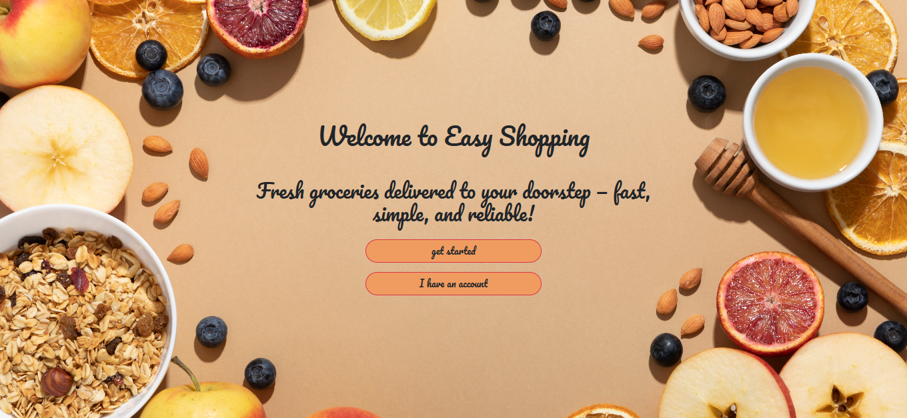
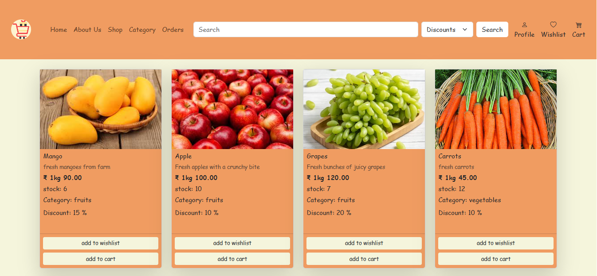
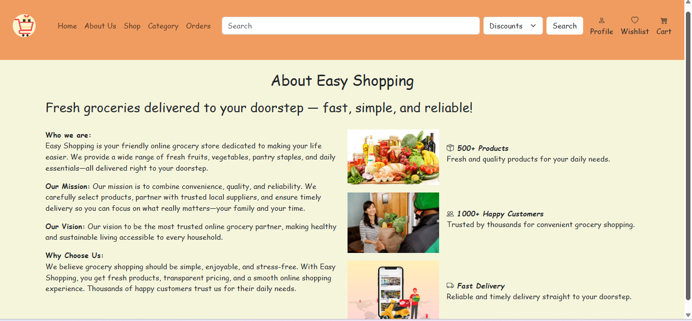
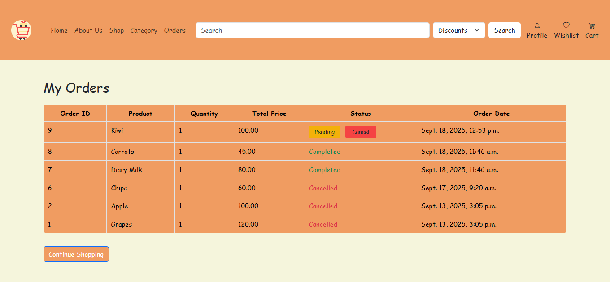
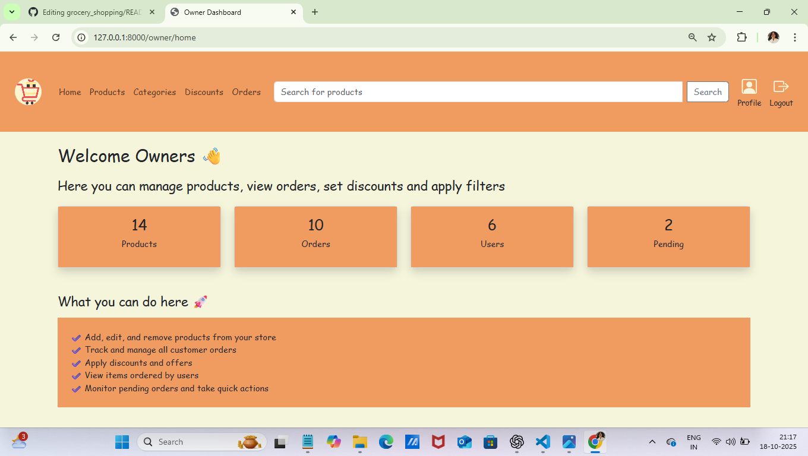

# 🛒 Online Grocery Shopping System

A **full-stack web application** for managing grocery shopping with a user-friendly interface and secure back-end functionality.  
It includes **User**, **Owner**, and **Admin** modules to efficiently handle products, orders, and customers.

---

## 🚀 Key Features
- User registration and login with secure authentication  
- Browse grocery products with search and filter options  
- Add items to cart and place orders seamlessly  
- Admin panel to manage products, orders, and customers  
- Responsive design using Bootstrap for mobile and desktop users  
- Real-time order tracking and status updates  

---

## 🛠️ Technologies Used
- **Frontend:** HTML, CSS, Bootstrap, JavaScript  
- **Backend:** Python (Django)  
- **Database:** MySQL  

---

## 💻 How to Run This Project

1. **Clone this repository**  
   (copy your project from GitHub to your computer)
   ```bash
   git clone https://github.com/nethika142-sys/grocery_shopping.git
   ```
   
2. Open the project in VS Code

3. Activate your virtual environment
  ```bash
  env\Scripts\activate
  ```
  
4. Install all required packages
   
   If you have a requirements.txt file:

   ```bash 
   pip install -r requirements.txt
   ```
  
   Or, if not, install Django manually:

   ```bash
   pip install django
   ```
  (Later you can create a requirements.txt using pip freeze > requirements.txt)

5. Go inside the project folder

  ```bash
  cd main_project
  ```
  
6. Run the Django development server

  ```bash
  python manage.py runserver
  ```
  
7. Open your browser and go to:
   
  👉 [http://127.0.0.1:8000/](http://127.0.0.1:8000/)

---

## 📸 Screenshots





